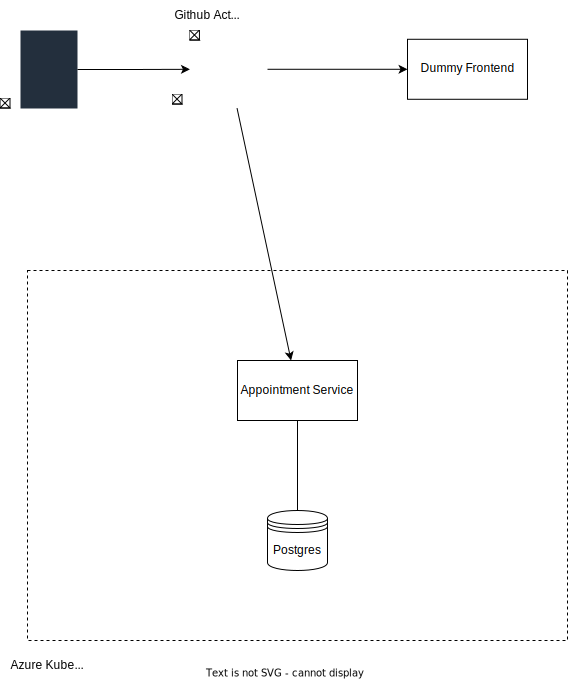

# Softwaretechnik Workshop Gruppe 7
## Inhaltsverzeichnis
- [Softwaretechnik Workshop Gruppe 7](#softwaretechnik-workshop-gruppe-7)
  - [Inhaltsverzeichnis](#inhaltsverzeichnis)
  - [1 Systemkomponenten](#1-systemkomponenten)
    - [Infrastruktur](#infrastruktur)
    - [Software](#software)
    - [Source Control](#source-control)
    - [Ausgangsschnittstellen](#ausgangsschnittstellen)
    - [Zielsysteme und Schnittstellen](#zielsysteme-und-schnittstellen)
  - [2 Netzwerkkonzept](#2-netzwerkkonzept)
    - [Was wird benötigt](#was-wird-benötigt)
  - [3 Cloud-Bedarf](#3-cloud-bedarf)
    - [Autarke Anteile](#autarke-anteile)
    - [Darstellung Aufbau](#darstellung-aufbau)
  - [4 Betriebskonzept](#4-betriebskonzept)
    - [Hardware-Wartungsbedarf?](#hardware-wartungsbedarf)
    - [Betriebssytem](#betriebssytem)
    - [Updateverfahren (Securitypatches,..)](#updateverfahren-securitypatches)
    - [Softwarepflege](#softwarepflege)
    - [Securitypatches,..](#securitypatches)
    - [Notfallkonzeption](#notfallkonzeption)
    - [Datensicherung/Logs](#datensicherunglogs)
  - [5 Support](#5-support)
    - [Entry point für Incidents](#entry-point-für-incidents)
    - [Supportzeit](#supportzeit)
    - [Reaktionszeit](#reaktionszeit)
    - [Wiederherstellungszeit](#wiederherstellungszeit)
    - [Wartungszugang erforderlich?](#wartungszugang-erforderlich)
  - [6 Bedienoberflächen](#6-bedienoberflächen)
    - [Systemvoraussetzungen](#systemvoraussetzungen)
    - [Nutzer- und Berechtigungskonzept](#nutzer--und-berechtigungskonzept)
## 1 Systemkomponenten
### Infrastruktur
Backend
- Docker Images
- AKS ([Azure Kubernetes Service](https://azure.microsoft.com/de-de/products/kubernetes-service/docker/)) free tier
  
Frontend
- Github Pages

CI/CD
- Github Actions
  
DB
- Postgres

### Software
Backend
- Java 17
- Quarkus
- RESTeasy, JPA

Frontend
- HTML
- JS mit jQuery
- CSS mit TailwindCSS

### Source Control
Github free tier 

### Ausgangsschnittstellen
- OpenAPI Spec TBD 

### Zielsysteme und Schnittstellen
- Terminverwaltung
- Core Functionalities
  - verschiedene User anlegen, bearbeiten, entfernen
  - Termine anlegen, einladen, verschieben, entfernen
  - Prüfung ob Termin verfügbar
- Stretch
  - Userverwaltung mit OAuth2 
  - Benachrichtungen per Mail
  - User Stats
- Backend only -> REST Api 
- Dummy Frontend zur Demonstration der Backend Funktionalität

## 2 Netzwerkkonzept 
### Was wird benötigt
- Domain
- TLS Zertifikate 
- Ingress Controller
TBD: klären, ob das Azure Free Tier public Domains & TLS Certs enthält

## 3 Cloud-Bedarf
### Autarke Anteile
### Darstellung Aufbau
## 4 Betriebskonzept
### Hardware-Wartungsbedarf?
### Betriebssytem
### Updateverfahren (Securitypatches,..)
### Softwarepflege 
### Securitypatches,..
### Notfallkonzeption
### Datensicherung/Logs
## 5 Support
### Entry point für Incidents
### Supportzeit
### Reaktionszeit
### Wiederherstellungszeit
### Wartungszugang erforderlich?
## 6 Bedienoberflächen
### Systemvoraussetzungen
### Nutzer- und Berechtigungskonzept
