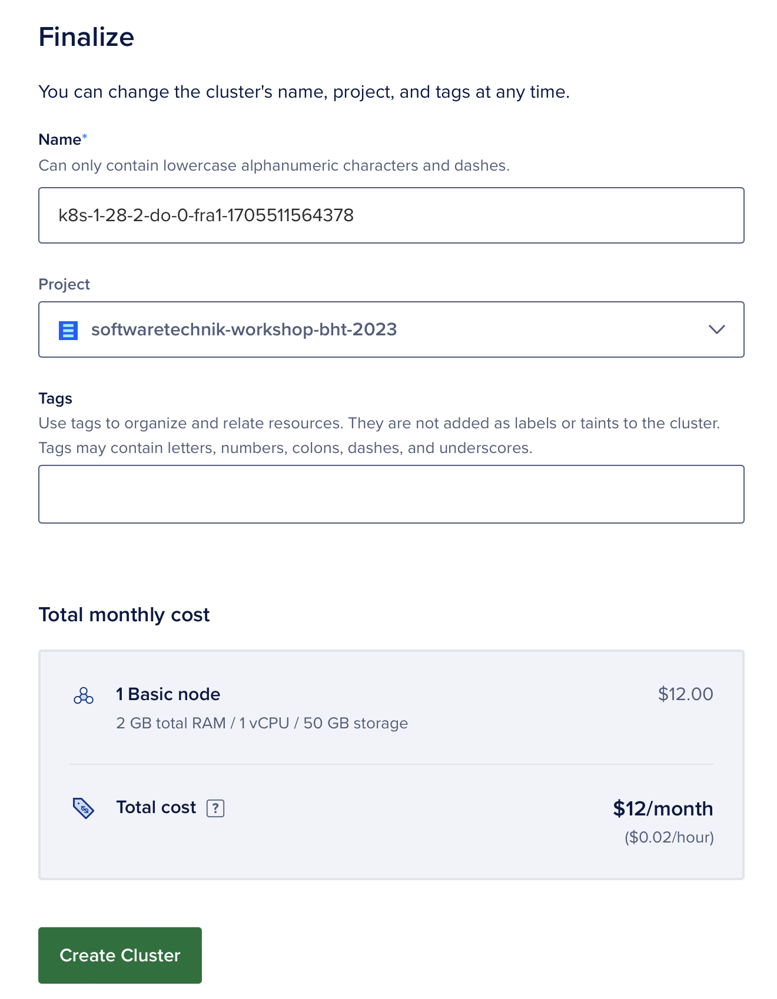
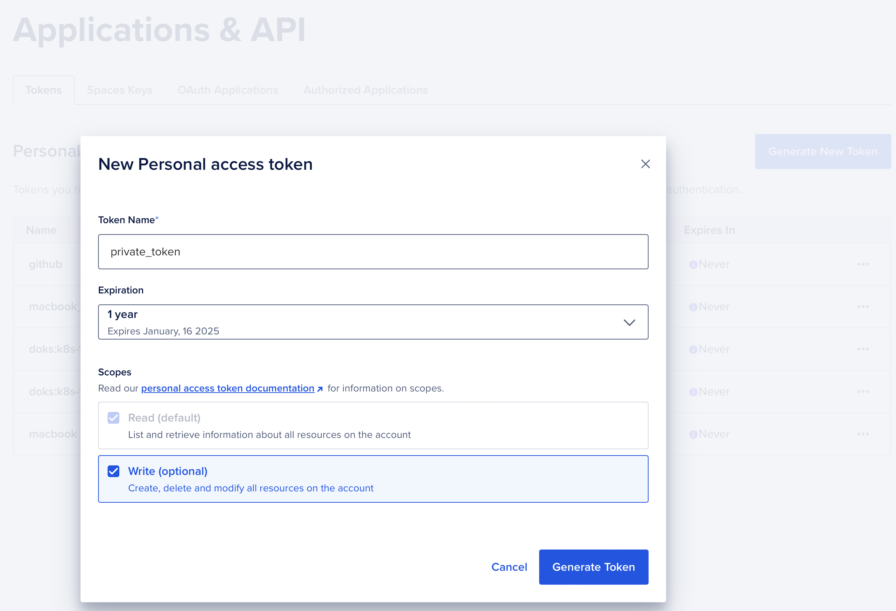
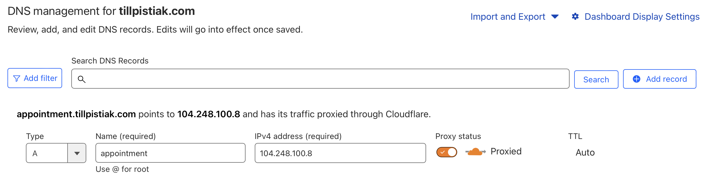
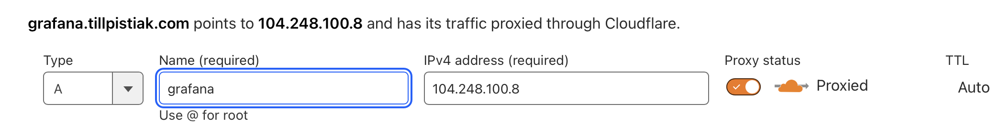
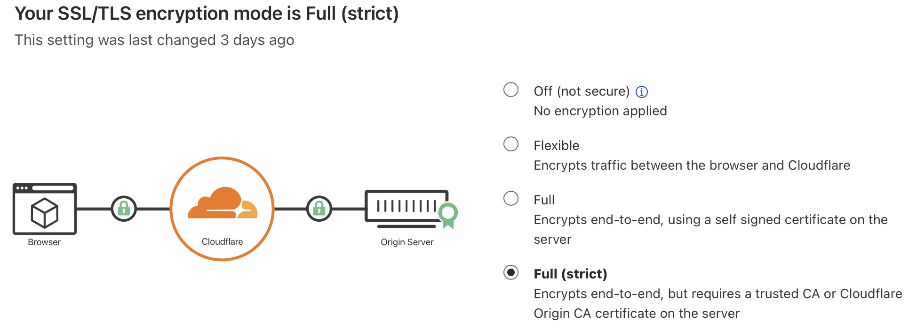
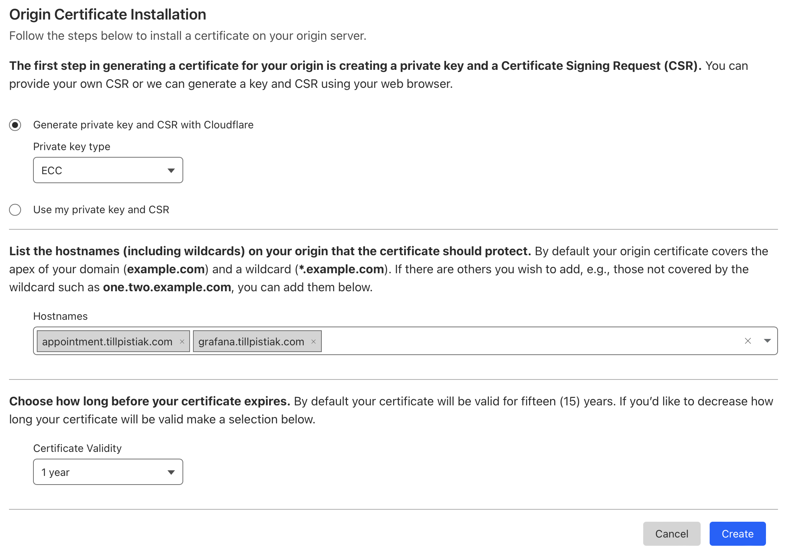
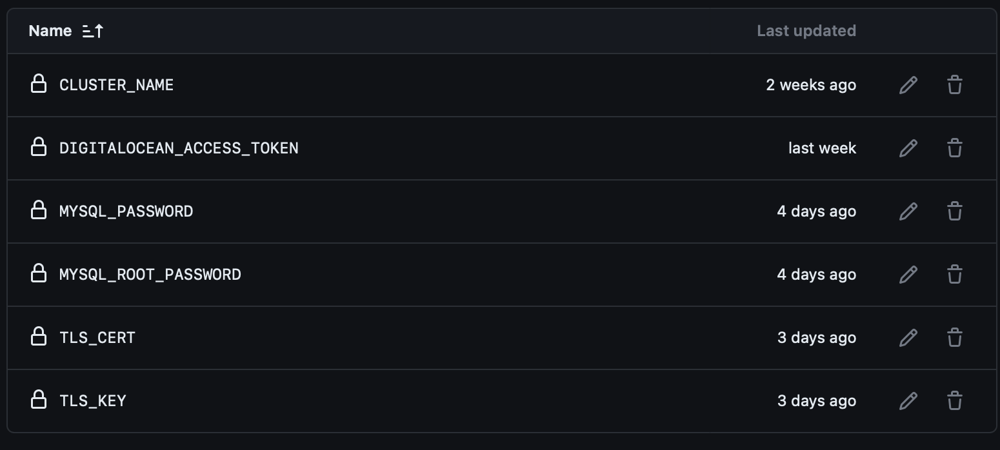
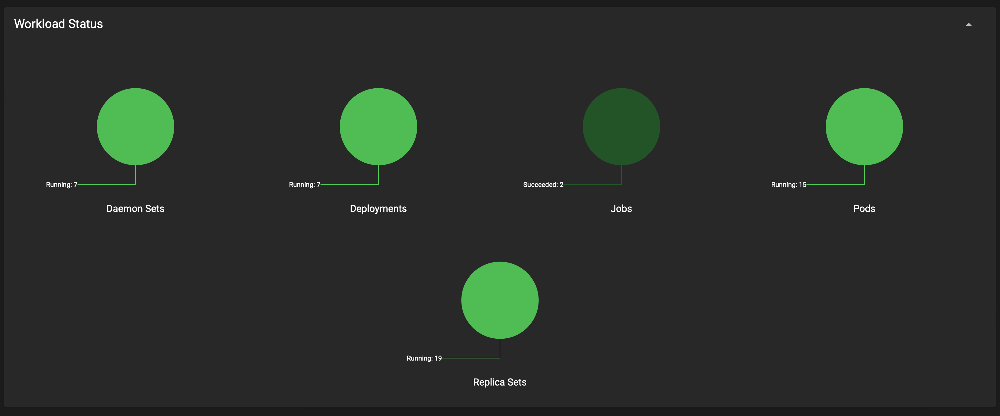
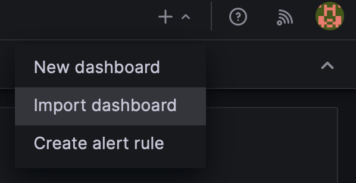
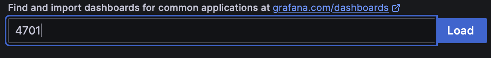

# AppointmentService
Authors:
- Merdan Erdogan
- Fariq Stephan Hofmann
- Georgios Kyloudis
- Till Pistiak

## Table of Contents
- [AppointmentService](#appointmentservice)
  - [Table of Contents](#table-of-contents)
  - [How to start developing locally?](#how-to-start-developing-locally)
  - [How to get it running in the cloud?](#how-to-get-it-running-in-the-cloud)
    - [Preparation](#preparation)
      - [Digital Ocean](#digital-ocean)
      - [Cloudflare](#cloudflare)
      - [Github](#github)
    - [SSL certificates from cloudflare](#ssl-certificates-from-cloudflare)
    - [testing with in-memory databases](#testing-with-in-memory-databases)
  - [What's next?](#whats-next)
    - [User Authentication \& Roles](#user-authentication--roles)
    - [Exception Handling](#exception-handling)
    - [Health Checks](#health-checks)
    - [Custom Metrics](#custom-metrics)
    - [Alert Manager](#alert-manager)
    - [Load Testing](#load-testing)
    - [Optimize Github Actions](#optimize-github-actions)

## How to start developing locally?
 The following steps are required to run the application locally on **MacOS**. Please make sure [Homebrew](https://brew.sh/), [SDKMAN](https://brew.sh/) and [Git](https://www.git-scm.com/downloads) are already present on your machine. 

For other operating systems the same tools are required. For installation guides please refer to the official documentation.
1. install necessary software <br>
   - Java JDK 17 (https://www.oracle.com/java/technologies/downloads/)
      ```bash
      sdk install java 17.0.10-amzn
      ```
   - IDE (https://code.visualstudio.com/Download)
      ```bash
      brew install vscode
      ```
      configure `code` command (https://code.visualstudio.com/docs/setup/mac)
   - Docker (https://www.docker.com/products/docker-desktop/)
      ```bash
      brew install docker
      ```
   - Maven (https://maven.apache.org/install.html) <br>
     :information_source: you can skip this step if you want to use maven wrapper
      ```bash
      brew install maven
      ```
2. checkout and open project in IDE
   ```bash
   git clone https://github.com/tillpistiak/softwaretechnik-workshop-bht-2023.git

   cd softwaretechnik-workshop-bht-2023
   
   code .
   ```

3. start database (make sure docker is already running)
    ```bash
    docker-compose up
    ```

4. run app
    ```bash
    mvn clean quarkus:dev
    ```
    :information_source: you can start developing now. Quarkus will recognize most changes itself and apply them via hot reload. Some will require a restart
5. run tests & quality gates
    ```bash
    mvn clean verify
    ```


## How to get it running in the cloud?

### Preparation

#### Digital Ocean

1. create Digital Ocean account, add payment details etc
2. create a new kubernetes cluster (Digital Ocean `Kubernetes / Create Cluster`)
   - choose Frankfurt as datacenter
   - keep the recommended version 
   - choose a pool & cluster name 
   - select cheapest options and only one node <br>
     :warning: selecting more than one node will not benefit availability as the application doesnt support running on multiple nodes in parallel at the moment
   - total monthly costs should be 12€ as of January 2024

3. create an access token for your local machine (Digital Ocean)
   - go to `API / Tokens / Personal Access Tokens` and click on "Generate New Token"
     - choose a name and select the prefered expiration time
     - enable write access
     - click on "Generate Token"
     - copy the generated token, it will be required for the next step and cant be shown again
   - create a **second** access token to use in your Github Repository, keep for later
  
4. configure kubectl on your local machine & install ingress-controller (Terminal)
   1. install with brew
      ```bash
      brew install doctl 
      ```
   2. login to your DO account with the generated token
      ```bash
      doctl auth init # paste the token when asked for it
      doctl kubernetes cluster kubeconfig save <use_your_cluster_name>
      ```
   3. check kubernetes status
      ```bash
      kubectl cluster-info
      # Output should look like
      #> Kubernetes control plane is running at https://d3e5528e-70df-4a9c-b511-47594d2e6fdb.k8s.ondigitalocean.com
      #> CoreDNS is running at https://d3e5528e-70df-4a9c-b511-47594d2e6fdb.k8s.ondigitalocean.com/api/v1/namespaces/kube-system/services/kube-dns:dns/proxy

      
      kubectl get nodes
      # Output should look like
      #> NAME                   STATUS   ROLES    AGE   VERSION
      #> pool-3mz19dpbc-x5qe1   Ready    <none>   25d   v1.28.2
      ```

   4. create load balancer & ingress controller ( :warning: doing this will create a 12$/month Digital Ocean Loadbalancer)
      ```bash
      # install ingress controller
      kubectl apply -f https://raw.githubusercontent.com/kubernetes/ingress-nginx/controller-v1.1.1/deploy/static/provider/do/deploy.yaml

      # edit resources of ingress controller
      # get ingress-controller deployment.yaml
      kubectl get deployment ingress-nginx-controller -n ingress-nginx -oyaml>ingress-controller.yaml
      
      # now update the resources in the created file
      code ingress-controller.yaml
      
      # use these values:
      # resources:
      #   limits:
      #     cpu: 50m
      #   requests:
      #     cpu: 50m 
      #     memory: 90Mi

      # after the file has been saved, apply it with kubectl
      kubectl apply -f ingress-controller.yaml
      
      # confirm pods have started
      kubectl get pods -n ingress-nginx -l app.kubernetes.io/name=ingress-nginx --watch

      # Output
      # NAME                                       READY   STATUS      RESTARTS   AGE
      # ingress-nginx-controller-c96557986-m47rq   1/1     Running     0          13m
      
      # confirm Load Balancer was successfully created
      # make sure EXTERNAL-IP is set for the Load Balancer
      kubectl get svc --namespace=ingress-nginx
      ```
    5. write `EXTERNAL-IP` down for later

#### Cloudflare

1. register domain ([Cloudflare Dashboard](https://dash.cloudflare.com))
   1. create a free account https://www.cloudflare.com/de-de/plans/ 
   2. go to `Domain Registration -> Register Domains`
   3. search for the domain
   4. select domain & complete payment
   

2. create dns entries ([Cloudflare Dashboard](https://dash.cloudflare.com))
   1. select your domain on the homepage of the cloudflare dashboard
   2. go to `DNS / Records`
   3. click on "Add record"
      1. select type `A`
      2. choose a name for the subnaim, e.g. "appointmentservice" -> this will create a DNS entry for the domain "`appointmentservice.<your_domain>.<your_tld>`"
      3. enter the `EXTERNAL_IP` from the Load Balancer into the `IPv4` field
      4. keep `Proxied` enabled
      5. click "Save" 
   4. do the same for the grafana subdomain, e.g. "`grafana.<your_domain>.<your_tld>`"


3. configure tls ([Cloudflare Dashboard](https://dash.cloudflare.com))
   1. go to `SSL/TLS / Overview`
   2. enable `Full(strict)` as encryption mode 
   3. go to `SSL/TLS / Origin Server`
   4. click on "Create Certificate"
   5. select `ECC` as private key type
   6. enter **BOTH** subdomains (service & grafana) as Hostnames
   7. select the preferred validity (will be done again before the certificate expires)
   8. click on "Create"
   9. copy both private key and certificate and store them securely. if you loose the private key you'll have to generate a new keypair   10. 
   10. convert the certificate and key to base64
       ```bash
       echo "<paste_certificate>"|base64
       echo "<paste_key>"|base64
       ```


#### Github

1. go to your repository and open the settings
2. go to `"Secrets and variables" / Actions`
3. Use the "new repository secret" button to create the following secrets, paste the mentioned values
   ```properties
   CLUSTER_NAME=<name_of_kubernetes_cluster> # can be found in DO dashboard

   DIGITALOCEAN_ACCESS_TOKEN=<do_access_token> # DO access token you created for GitHub
   
   MYSQL_PASSWORD=<password> # you can choose the password
   
   MYSQL_ROOT_PASSWORD=<password> # you can choose the password
   
   TLS_CERT=<tls_cert_base64> # base64 encoded tls certificate from cloudflare
   
   TLS_KEY=<tls_key_base64> # base64 encoded tls private key from cloudflare
   ```
4. result should look like this
5. go to the "Environtment Variables" tab
6. Use the "new repository variable" button to create the following variables, paste the mentioned values
   ```properties
   SERVICE_HOST=<service-subdomain.domain.tld> # e.g. appointment.tillpistiak.com

   GRAFANA_HOST=<grafana-subdomain.domain.tld> # e.g.  grafana.tillpistiak.com
7. give write permissions to github_token as described in [3_BUILD_RELEASE](documentation/markdown/3_BUILD_RELEASE.md#configuration-2)

### Deployment

1. go to Github Actions in your repository
2. select the build pipeline
3. enter the preferred tag version
4. run the workflow
5. wait for the build workflow to complete
6. make sure the deploy workflow has been triggered and wait for it to complete
7. got to your kubernetes cluster in the Digital Ocean Dashboard
8. Open the Kubernetes Dashboard
9. Wait for all workloads to become green

### Monitoring
1. open grafana subdomain (e.g. https://grafana.<your_domain>.<your_tld>)
1. login with admin:admin
1. set new personal password
1. connect to prometheus
   1. go to Home > Connections > Add new connection
   2. choose Prometheus as data source
   3. click "Add new data source"
   4. enter `prometheus-internal-service:9090` as prometheus server url
   5. keep defaults for everything else
   6. click save & test
2. import java micrometer dashboard
   1. click on the "+" in the menu bar and choose Import dashboard 
   2. enter `4701` as dashboard id
   3. click load
3. create dashboard for custom metrics
   

## Lessons Learned
### Nginx config in Digital Ocean kubernetes
- digital ocean is forcing you to create a (billed) load balancer
- the easiest way to get it running is therefore to use their nginx template
- this will automatically create the load balancer
- using the marketplace or installing the nginx-controller by other means, e.g. manually,can lead to problems

### Write access deployment.yaml / prometheus
- per default, pods don have write access to mounted persitent volumes
- if prometheus cant perform write operations, the pod wont start 
- to gain writing permissions, the `security context` has to be adapted
  ```yaml
  securityContext:
    fsGroup: 2000
  ```

### SSL certificates from cloudflare
- we initially thought the "Origin Server" certificates which can be issued for free by cloudflare are meant to replace the automatically generated certs which are only free for the first level of subdomains
- we assumed that we could just use them in our ingress to secure the connections between clients and our backend, especially since the SAN values were correct
- in fact, these are only meant to secure the connection from our cluster to the cloudflare proxy, so we would always receive an error `ERR_SSL_VERSION_OR_CIPHER_MISMATCH` as the proxy only allows tls for one level of subdomains in the free tier
- the solution was to use just one level of subdomains, this way we are able to keep cloudflare proxy enabled 

### testing with in-memory databases
- to create an lightweight and easy to execute test setup which can run in Github Actions without further configuration we decided to use an in-memory database for our tests
- we first wanted to use H2 but Liquibase and Hibernate had some issues so we decided to try out if derby would work better before wasting to much time on H2
- both had one issue in common: our table "user" created problems because "user" is a keyword in both SQL dialects
- in the end, Derby could be initialized by Hibernate without changing much. So we decided to keep it that way as we didnt know how long it would take us to configure Liquibase for Derby

## What's next?
### User Authentication & Roles
- currently we dont have any form of authentication -> everyone can access the application
- we want to add OIDC based user authentication
- the subject of the tokens will include the user_id
- having user authentication in place will also enable us to implement role based access rights (currently the status "owner" does not play any role)
- adding admin accounts

### Exception Handling
- introduce global exception handling for the controller
- some exceptions arent caught at the moment, this has to be fixed to reduce leakage of information
  - Unique Constraing violations
  - Other DB exceptions

### Health Checks
- the pods of the appointment-service should only be "ready" and "live" under certain circumstances
  - DB accessible
  - other default metrics
- configuration should be easy with [Smallrye Health](https://quarkus.io/guides/smallrye-health)


### Custom Metrics
- micrometer can be used to create custom metrics
- these metrics can then be visualized by grafana to create better insights into the performance of the application
- possible metrics
  - how often is each endpoint called per time unit
  - how long does it take to process a request
  - how long does it take to execute a transaction
- there should also be metrics for the database

### Alert Manager
- an alert manager keeps an eye on the metrics scraped by prometheus
- if a defined treshold is passed on one metrics, the alert manager will send a message, e.g. to an email address 
- this is extremely important to prevent downtime, as potential risks such as insufficient memory, storage or cpu can be detected and fixed
- it is also important to detect potential attacks or threats
- https://prometheus.io/docs/alerting/latest/alertmanager/


### Load Testing
- to be sure the application and infrastructure is ready to be released to the public, we must be sure it can handle a certain amount of load
- we could use [jMeter](https://jmeter.apache.org/) to send many requests at once to the different endpoints
- jMeter can also be used to test more complex scenarios
- running these tests while having an eye on grafana and alert manager can give us insights into the performance and durability of the service

### Optimize Github Actions
- currently every workflow run starts from scratch
- java, maven and all the dependencies have to be fetched
- this makes the workflow slow and on the long term more expensive 
- to address this issue we should use [Caches](https://docs.github.com/en/actions/using-workflows/caching-dependencies-to-speed-up-workflows) 
