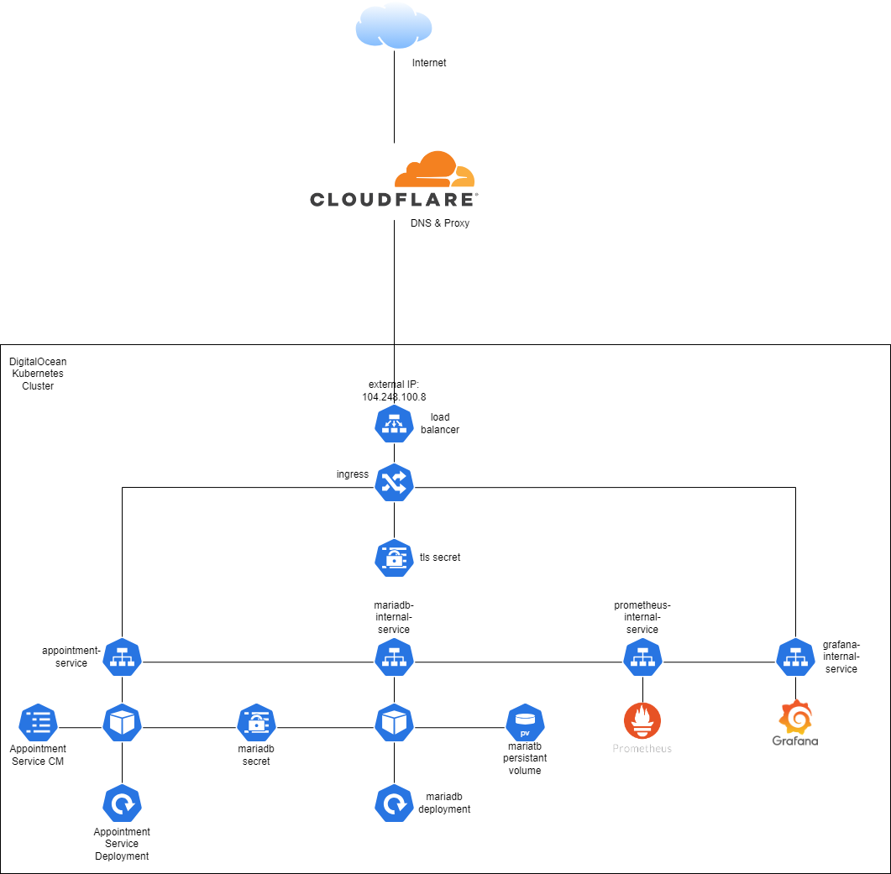
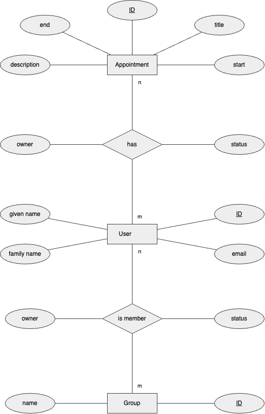

# PLAN (Konzept)
## Table of Contents
- [PLAN (Konzept)](#plan-konzept)
  - [Table of Contents](#table-of-contents)
  - [1 Systemkomponenten](#1-systemkomponenten)
    - [Infrastruktur](#infrastruktur)
    - [Software](#software)
    - [Source Control](#source-control)
    - [Ausgangsschnittstellen](#ausgangsschnittstellen)
    - [Zielsysteme und Schnittstellen](#zielsysteme-und-schnittstellen)
  - [2 Netzwerkkonzept](#2-netzwerkkonzept)
    - [Was wird benötigt](#was-wird-benötigt)
  - [3 Cloud-Bedarf](#3-cloud-bedarf)
    - [Autarke Anteile](#autarke-anteile)
    - [Darstellung Aufbau](#darstellung-aufbau)
  - [4 Support](#4-support)
  - [Entry Point für Incidents:](#entry-point-für-incidents)
  - [Supportzeit:](#supportzeit)
  - [Reaktionszeit:](#reaktionszeit)
  - [Wiederherstellungszeit:](#wiederherstellungszeit)
  - [Wartungszugang erforderlich:](#wartungszugang-erforderlich)
  - [Tools](#tools)
## 1 Systemkomponenten
### Infrastruktur
Backend
- Digital Ocean Cloud
- Cloudflare DNS & TLS

Components

  
Frontend
- Github Pages

CI/CD
- Github Actions
- Grafana
- Prometheus
  
DB
- MariaDB
- Derby (Testing)

### Software
Backend
- Java 17
- Quarkus
- RESTeasy, JPA

Frontend
- HTML
- JS mit jQuery

### Source Control
Github free tier 

### Ausgangsschnittstellen
- [OpenAPI Spec](documentation/api/appointment-service-v1.yaml)
- [Postman Collection](documentation/postman/Appointment%20Service.postman_collection.json)

### Zielsysteme und Schnittstellen
- Terminverwaltung
- Core Functionalities
  - verschiedene User anlegen, bearbeiten, entfernen
  - Termine anlegen, einladen, verschieben, entfernen
  - Prüfung ob Termin verfügbar
- Stretch
  - Userverwaltung mit OAuth2 
  - Benachrichtungen per Mail
  - User Stats
- Backend only -> REST Api 
- Dummy Frontend zur Demonstration der Backend Funktionalität

## 2 Netzwerkkonzept 
### Was wird benötigt
- Domain von Cloudflare
- TLS Zertifikate von Cloudflare
- Digital Ocean Load Balancer 
- nginx Ingress Controller

## 3 Cloud-Bedarf
### Autarke Anteile
- Digital Ocean K8s
### Darstellung Aufbau
## 4 Support

## Entry Point für Incidents:
- Helpdesk: [support@appointmentservice.com]
- Hotline: [+15072 778500]
- Reaktionszeit: Innerhalb von 24 Stunden
- Kritische Probleme: Sofortige Reaktion, idealerweise innerhalb von 2 Stunden

## Supportzeit:
- Montag bis Freitag: 9:00 bis 17:00 Uhr (UTC)
- Live-Support während dieser Zeiten
- 24/7-Support für Premium-Nutzer

## Reaktionszeit:
- Nicht dringende Anfragen: Innerhalb von 24 Stunden
- Kritische Probleme (Hotline): Innerhalb von 2 Stunden

## Wiederherstellungszeit:
- Kritische Probleme: Innerhalb von 2 Stunden
- Nicht dringende Probleme: Innerhalb von 2-3 Werktagen

## Wartungszugang erforderlich:
- Vorankündigung von Wartungsarbeiten
- Durchführung während Zeiten geringer Nutzung
- Klare Anweisungen für Nutzer während Wartungsarbeiten

## Tools 
- IDE
  - IntelliJ
  - Visual Studio Code
- Database Administration
  - Adminer
- Diagrams
  - draw.io
- Source Control
  - Github: https://github.com/tillpistiak/softwaretechnik-workshop-bht-2023
- API Testing
  - Postman
- Kommunikation
  - kurzfristig: WhatsApp
  - calls: Discord
- Projektmanagement
  - Trello: https://trello.com/b/FcsMDrNv/softwaretechnik-projekt
  - Github 
  
