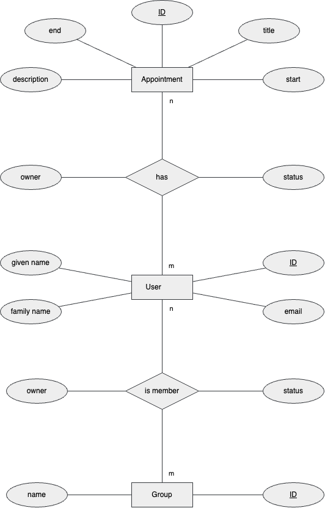

# CODE
## Table of Contents
- [CODE](#code)
  - [Table of Contents](#Table of Contents)
  - [Frameworks](#frameworks)
    - [Quarkus](#quarkus)
      - [Configuration \& Initial Setup](#configuration--initial-setup)
    - [RestEasy](#resteasy)
      - [Configuration](#configuration)
      - [Usage](#usage)
    - [Lombok](#lombok)
      - [Configuration](#configuration-1)
      - [Usage](#usage-1)
  - [Database](#database)
    - [MariaDB](#mariadb)
      - [Configuration](#configuration-2)
    - [Liquibase](#liquibase)
      - [Configuration](#configuration-3)
      - [Usage](#usage-2)
    - [Hibernate](#hibernate)
      - [Configuration](#configuration-4)
      - [Usage #TBD](#usage-tbd)
  - [Data Model](#data-model)


## Frameworks
### Quarkus
Quarkus is a framework that is commonly used in software development. It provides a lightweight and fast runtime for building cloud-native applications. With Quarkus, developers can leverage the benefits of Java and other JVM languages while achieving low memory consumption and fast startup times. It offers seamless integration with popular frameworks and libraries, making it a popular choice for developing microservices and serverless applications. Quarkus also provides excellent support for reactive programming and offers efficient resource utilization, making it well-suited for modern, scalable applications.
(Github Copilot)

#### Configuration & Initial Setup
1. create a new project on https://code.quarkus.io/
2. download the project as a zip
3. unpack the zip and move the files into the project source folder
4. run `./mvnw quarkus:dev`

### RestEasy
RestEasy is a powerful and lightweight framework for building RESTful web services in Java. It is part of the Quarkus ecosystem, which is designed to optimize Java applications for cloud-native and microservices architectures.

RestEasy provides a simple and intuitive way to develop RESTful APIs by leveraging annotations and conventions. It integrates seamlessly with popular Java frameworks and libraries, making it easy to work with existing codebases. RestEasy also supports reactive programming, allowing developers to build scalable and responsive applications.

One of the key advantages of RestEasy is its efficient resource utilization, which enables low memory consumption and fast startup times. This makes it well-suited for modern, cloud-native applications that require high performance and scalability.
(Github Copilot)

#### Configuration
1. add dependencies to pom.xml ([explanation pom.xml](https://maven.apache.org/guides/introduction/introduction-to-the-pom.html))
    ```xml
    <dependency>
        <groupId>io.quarkus</groupId>
        <artifactId>quarkus-resteasy-reactive</artifactId>
    </dependency>
    <dependency>
        <groupId>io.quarkus</groupId>
        <artifactId>quarkus-resteasy-reactive-jackson</artifactId>
    </dependency>
    <dependency>
        <groupId>io.quarkus</groupId>
        <artifactId>quarkus-smallrye-openapi</artifactId>
    </dependency>
    ```
1. configure cors in application.properties
   ```properties
   quarkus.http.cors=true
   quarkus.http.cors.origins=http://127.0.0.1:5500,https://tillpistiak.github.io
   ```
#### Usage
Adding REST controllers
```java
@Path("/users")
public class UserController {
    ...
}
```
Adding REST methods
```java
@Path("/{id}")
@GET
@Produces(MediaType.APPLICATION_JSON)
public User getUser(@PathParam("id") Long userId) {
    ...
}
```

### Lombok
Lombok is a popular Java library that helps reduce boilerplate code and increases developer productivity. It provides annotations that automatically generate common code patterns, such as getters, setters, constructors, and toString methods. By using Lombok, developers can write cleaner and more concise code, focusing on the business logic rather than repetitive tasks. Lombok integrates seamlessly with popular IDEs and build tools, making it easy to adopt in existing projects. It is widely used in the Java ecosystem to simplify code development and improve code readability.
(Github Copilot)

#### Configuration
add dependencies to pom.xml
```xml
<dependency>
    <groupId>org.projectlombok</groupId>
    <artifactId>lombok</artifactId>
    <version>1.18.30</version>
    <scope>provided</scope>
</dependency>
```

#### Usage
we use Lombok to generate the following components:
- Getter
- Setter
- Constructors
- Builder Pattern

example:
```java
@Builder
@NoArgsConstructor
@AllArgsConstructor
public class AppointmentUser

@Getter
@Setter
private Long id;
```

## Database
### MariaDB
MariaDB is a popular open-source relational database management system. It is a fork of MySQL and offers several benefits such as high performance, scalability, and robustness. It supports a wide range of data types, provides advanced security features, and has excellent compatibility with various programming languages and frameworks.
(Github Copilot)

#### Configuration 
1. add dependenciy to pom.xml
    ```xml
    <dependency>
      <groupId>io.quarkus</groupId>
      <artifactId>quarkus-jdbc-mariadb</artifactId>
    </dependency>
    ```
1. configure the JDBC connection in the quarkus application.properties
    ```properties
    quarkus.datasource.db-kind=mariadb
    quarkus.datasource.username=user
    quarkus.datasource.password=password
    quarkus.datasource.jdbc.url=jdbc:mariadb://localhost:3306/appointment_service
    ```

### Liquibase
Liquibase is an open-source database schema migration tool that allows you to manage and version your database changes. It provides a way to define database changes in a declarative manner using XML, YAML, or JSON formats. Liquibase tracks the changes you make to your database schema over time and applies those changes in a controlled and consistent manner.

With Liquibase, you can define database changes as "change sets" which represent a single logical change to your database schema, such as creating a table, adding a column, or modifying an existing table structure. Each change set is uniquely identified by an ID and can be executed in a specific order. (Github Copilot)

#### Configuration
1. add dependenciy to pom.xml
    ```xml
    <dependency>
      <groupId>io.quarkus</groupId>
      <artifactId>quarkus-liquibase</artifactId>
    </dependency>
    ```
1. configure Liquibase in the quarkus application.properties
    ```properties
    quarkus.liquibase.migrate-at-start=true
    ```
1. add changelog file to resources/db

#### Usage
- add table
  ```xml
  <createTable tableName="appointment">
  ```
- define column
  ```xml
  <column name="id" autoIncrement="true" type="bigint(20)">
    <constraints primaryKey="true" nullable="false"/>
  </column>
  ```
- add foreign keys
  ```xml
  <addForeignKeyConstraint baseTableName="group_user" 
    baseColumnNames="group_id"
    constraintName="fk_group_user_group"
    referencedTableName="groups"
    referencedColumnNames="id">
  </addForeignKeyConstraint>
  ```
- add unique constraints 
  ```xml
  <addUniqueConstraint 
    tableName="appointment_user" 
    columnNames="appointment_id, user_id">
  </addUniqueConstraint>
  ```

### Hibernate
Hibernate is a popular open-source object-relational mapping (ORM) framework for Java. It provides a convenient way to map Java objects to database tables and vice versa, allowing developers to work with objects instead of writing complex SQL queries.

With Hibernate, developers can define entity classes that represent database tables and define relationships between them using annotations or XML mappings. Hibernate takes care of generating the SQL queries needed to interact with the database, including fetching, inserting, updating, and deleting records.

Hibernate also provides features like lazy loading, caching, and transaction management, which help improve performance and simplify database operations. It supports various database systems and provides a consistent API for working with different databases.

Overall, Hibernate simplifies the development of database-driven applications by abstracting away the complexities of SQL and providing a high-level object-oriented approach to data persistence. (Github Copilot)

#### Configuration
1. add dependenciy to pom.xml
    ```xml
    <dependency>
      <groupId>io.quarkus</groupId>
      <artifactId>quarkus-hibernate-orm-panache</artifactId>
    </dependency>
    ```

#### Usage #TBD
- define entities 
  ```java
  @Entity(name = "appointment") 
  public class Appointment extends PanacheEntityBase {
  ```
- define columns
  ```java
  @Id
    @GeneratedValue(strategy = GenerationType.IDENTITY)
    @Column(name = "id", nullable = false)
    @Getter
    @Setter
  ```
- define relations
  ```java
  @OneToMany(mappedBy = "user", fetch = FetchType.EAGER, cascade = CascadeType.REMOVE)
      @Getter
      @Setter
      @JsonIgnore
      private List<AppointmentUser> appointments = new ArrayList<>();
  ```
- get entities from db
  ```java
  @Transactional
    public Appointment updateAppointment(Long appointmentId, Appointment appointment) {
        Appointment existingAppointment = findSingleAppointment(appointmentId);
        existingAppointment.setTitle(appointment.getTitle());
        existingAppointment.setDescription(appointment.getDescription());
        existingAppointment.setStart(appointment.getStart());
        existingAppointment.setEnd(appointment.getEnd());
        existingAppointment.persist();
        return existingAppointment;
    }
  ```
- persist entites
  ```java
  @Transactional
    public void addNewAppointment(Appointment newAppointment) {
        newAppointment.persist();
    }
  ```
- delete entites
  ```java
   @Transactional
    public void deleteGroup(Long groupId) {
        Group.deleteById(groupId);
    }
  ```

## Data Model

