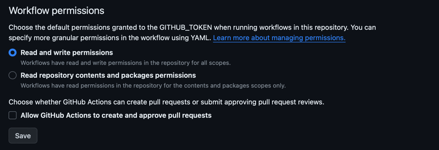
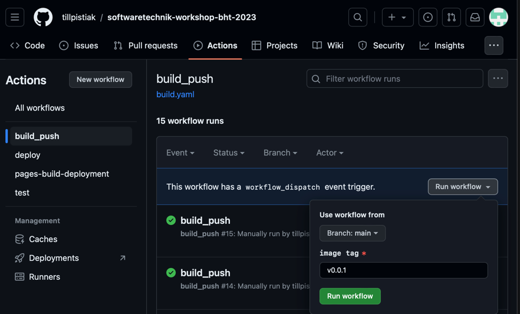

# BUILD

## Inhaltsverzeichnis
- [BUILD](#build)
  - [Inhaltsverzeichnis](#inhaltsverzeichnis)
  - [Build Tool: Maven](#build-tool-maven)
    - [Configuration](#configuration)
  - [Containerisation: Docker](#containerisation-docker)
    - [Configuration](#configuration-1)
  - [Container Registry: ghcr](#container-registry-ghcr)
    - [Configuration](#configuration-2)
  - [CI: Github Actions](#ci-github-actions)
    - [Pipeline Description](#pipeline-description)
    - [Run Pipeline](#run-pipeline)

## Build Tool: Maven
Maven is a popular build automation tool primarily used for Java projects. It provides a comprehensive and standardized way to manage project dependencies, compile source code, run tests, package the application, and deploy it to various environments.

With Maven, you define your project's configuration in a declarative manner using an XML file called pom.xml (Project Object Model). This file contains information about the project's structure, dependencies, plugins, and other build-related settings.

One of the key features of Maven is its dependency management system. You can specify the libraries and frameworks your project depends on, and Maven will automatically download and include them in your project's classpath. This simplifies the process of managing external dependencies and ensures consistent builds across different environments.

Maven also supports a wide range of plugins that extend its functionality. These plugins can be used to perform tasks such as code quality checks, code coverage analysis, documentation generation, and deployment to remote servers. (Github Copilot)

### Configuration
We can use the default pom.xml which was generated on code.quarkus.io. 
To build the project the following command can be used:
```bash
./mvw clean package
```
This command will clean the `/target` folder and generate a new build of the application. The resulting .jar file which will be required for the following steps can be found in `/target/quarkus-app/quarkus-run.jar`

## Containerisation: Docker
Docker is an open-source platform that allows you to automate the deployment, scaling, and management of applications using containerization. Containers are lightweight, isolated environments that package everything needed to run an application, including the code, runtime, system tools, and libraries. Docker provides a consistent and portable environment, making it easier to develop, test, and deploy applications across different environments. (Github Copilot)

### Configuration
to create a docker image a `Dockerfile` is required

1. define base image, we use a slim jdk version to safe memory & storage in the cloud
   ```Dockerfile
   FROM openjdk:17-jdk-slim
   ```
2. copy application files
   ```Dockerfile
   COPY --chown=185 target/quarkus-app/lib/ /deployments/lib/   
   COPY --chown=185 target/quarkus-app/*.jar /deployments/
   COPY --chown=185 target/quarkus-app/app/ /deployments/app/
   COPY --chown=185 target/quarkus-app/quarkus/ /deployments/quarkus/
   ```
3. define port 
   ```Dockerfile
   EXPOSE 8080
   ```
1. set user
   ```Dockerfile
   USER 185
   ```
4. run application
   ```Dockerfile
   ENTRYPOINT [ "java", "-jar", "/deployments/quarkus-run.jar" ]
   ```

## Container Registry: ghcr
GitHub Container Registry (GHCR) is a container registry provided by GitHub. It allows you to store and manage Docker container images within your GitHub repositories. GHCR integrates seamlessly with GitHub Actions, making it easy to build, test, and deploy your containerized applications directly from your GitHub repository. With GHCR, you can leverage the power of GitHub's ecosystem to store, version, and distribute your container images, enabling efficient collaboration and continuous integration/continuous deployment (CI/CD) workflows for your Java and Maven projects. (Github Copilot) 
<br>Documentation: https://docs.github.com/de/actions 

### Configuration
- **make sure GitHub Packages are enabled in the settings of your personal GitHub Profile**
- the registry is available under the name of the repository: `ghcr.io/softwaretechnik-workshop-bht-2023/appointment-service`
- give read/write access to GitHub Token to allow publishing images to ghcr (`Settings / Actions / General / Workflow permissions -> Read and write permissions`)
  


## CI: Github Actions
GitHub Actions is a powerful automation tool provided by GitHub that allows you to define custom workflows for your software development projects. With GitHub Actions, you can automate various tasks such as building, testing, and deploying your code directly from your GitHub repository. (Github Copilot)

### Pipeline Description
1. define trigger
2. checkout project and prepare java
3. build the application with maven
   ```yaml
   - name: Build JAR
     run: |
        ./mvnw clean package
   ```
4. login to container registry<br>
   ```yaml
    - name: Login to GitHub Container Registry
      uses: docker/login-action@v3
      with:
        registry: ghcr.io
        username: ${{ github.actor }}
        password: ${{ secrets.GITHUB_TOKEN }}
   ```
   `github.actor` - Github Username <br>
   `secrets.GITHUB_TOKEN` - Access Token which is automatically available in Gitub Actions Environments
5. prepare build tool
   ```yaml
    - name: Set up Docker Buildx
      uses: docker/setup-buildx-action@v3
   ```
6. build image, set tag and publish it to registry
   ```yaml
   - name: Build and push
     uses: docker/build-push-action@v5
     with:
        context: .
        file: ./Dockerfile
        push: true
        tags: ghcr.io/${{ github.repository }}/appointment-service:${{ github.event.inputs.tag }}, ghcr.io/${{ github.repository }}/appointment-service:latest

   ```

### Run Pipeline
The pipeline has a manual trigger which can be activated from the Actions Tab on Github
1. go to actions
2. select pipeline
3. enter tag number (should be higher than old number)
4. run workflow



