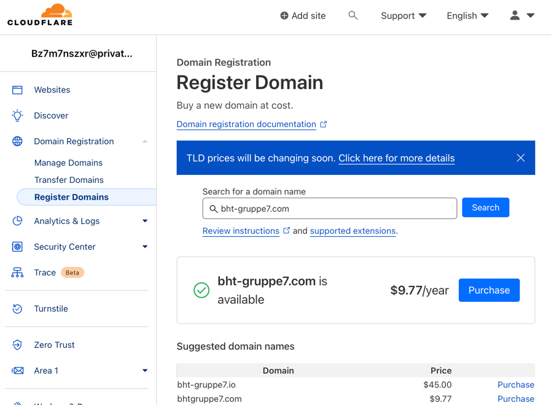

# OPERATE

## Table of Contents
- [OPERATE](#operate)
  - [Table of Contents](#table-of-contents)
  - [Domain: Cloudflare](#domain-cloudflare)
  - [Load Balancer / Ingress Controller](#load-balancer--ingress-controller)
  - [ingress](#ingress)
  - [DNS](#dns)
  - [TLS](#tls)

## Domain: Cloudflare
*A domain is a human-readable, alphanumeric label associated with a specific IP address on the internet. It serves as a user-friendly way to locate and access websites or resources on the World Wide Web. Domains play a critical role in simplifying the way users navigate the internet, providing a recognizable and standardized naming system for online resources.* (ChatGPT)

Cloudflare is a popular choice to register a new domain. To register a new domain on cloudflare, the following steps are required:

1. create a free account https://www.cloudflare.com/de-de/plans/ 
2. go to `Domain Registration -> Register Domains`
3. search for the domain
4. select domain & complete payment

## Load Balancer / Ingress Controller
A load balancer and an ingress controller are both components used in managing network traffic in a distributed system. Let's break down each of them:

Load Balancer: A load balancer is responsible for distributing incoming network traffic across multiple servers or resources to ensure efficient utilization and high availability. It acts as a traffic manager, evenly distributing requests to different servers based on various algorithms such as round-robin, least connections, or IP hash.
The main purpose of a load balancer is to prevent any single server from becoming overwhelmed with traffic, thus improving the overall performance and reliability of the system. It helps to scale horizontally by adding more servers and distributing the load among them.
## ingress

## DNS
*DNS, or Domain Name System, is a decentralized hierarchical system that translates human-readable domain names into IP addresses.* (ChatGPT)

## TLS
*TLS, or Transport Layer Security, is a cryptographic protocol that ensures secure communication over a computer network. Operating at the transport layer, TLS encrypts data transmissions between applications to protect against eavesdropping and tampering. It is commonly used to secure connections on the internet, such as HTTPS for secure web browsing.* (ChatGPT)

